# ESP32 Weather Station with TFT Display, RSS News and WiFi Clock 🌦️

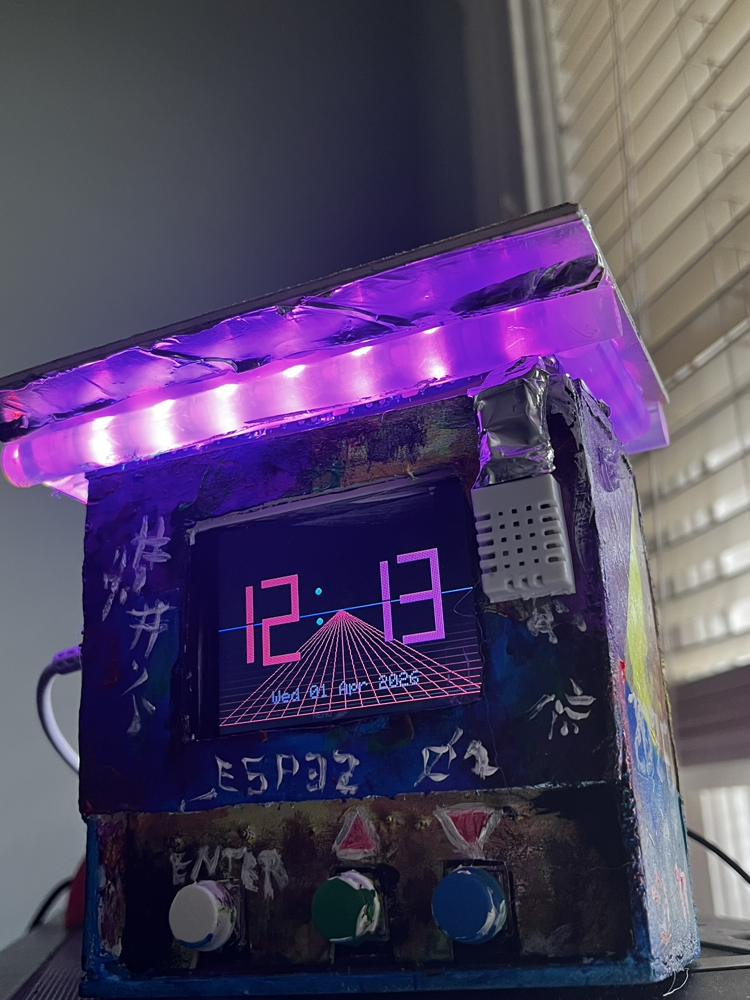
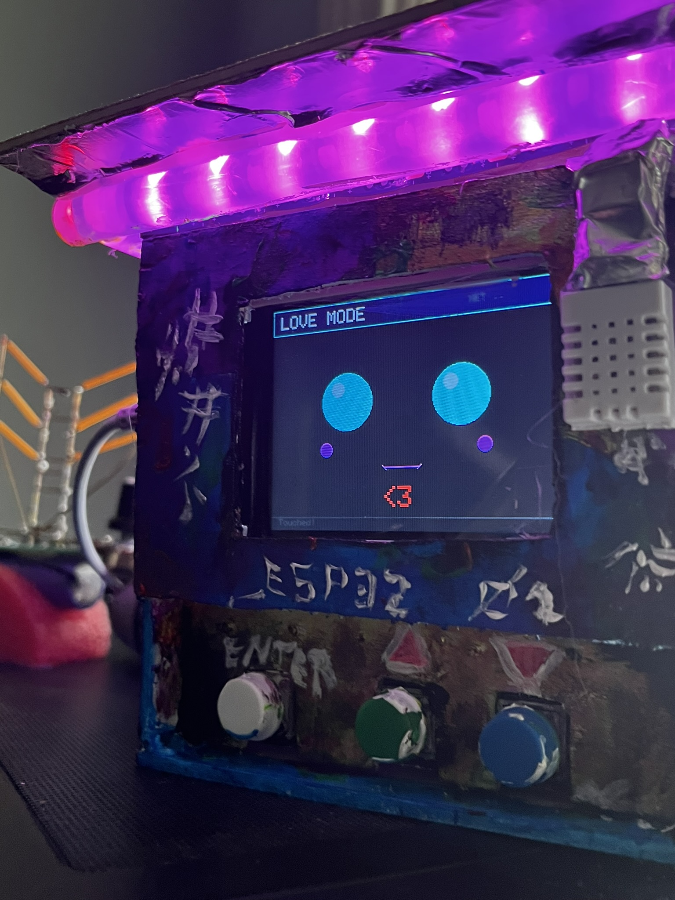

## Overview

This project is a DIY Weather Station built using an ESP32 microcontroller, a BME280 temperature and humidity sensor, and a 2.8" TFT color display.

The system displays:

• Local environmental data  
• Live news from RSS feeds  
• Real-time clock and calendar synchronized over WiFi  

Navigation is done using hardware buttons and a custom menu interface.

The project is currently "finish" my skills of carpinter are not the best but hopefully I could make it someday in a 3D printer.

---

## Features

- Local temperature measurement (DHT22)
- Local humidity measurement (DHT22)
- Real-time clock via WiFi (NTP)
- RSS news feeds:
  - BBC News
  - UK News
- Cork Airport live weather data
- Interactive menu system
- Custom graphical TFT interface

---

## Hardware Used

- ESP32 Dev Module
- DHT22 Temperature & Humidity Sensor
- 2.8" ILI9341 TFT Display (240x320)
- Push buttons (menu navigation)
- Breadboard
- Jumper wires

## Project Photos

### Breadboard Prototype
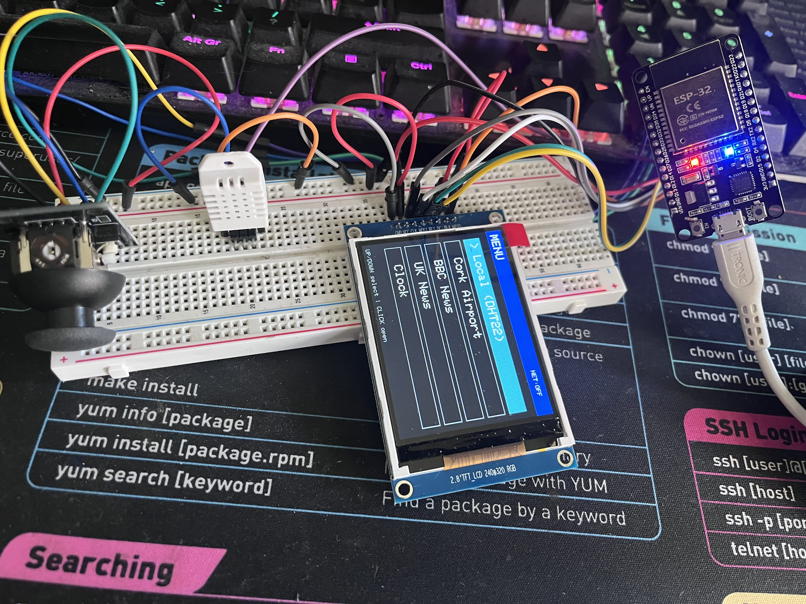

### Project Build
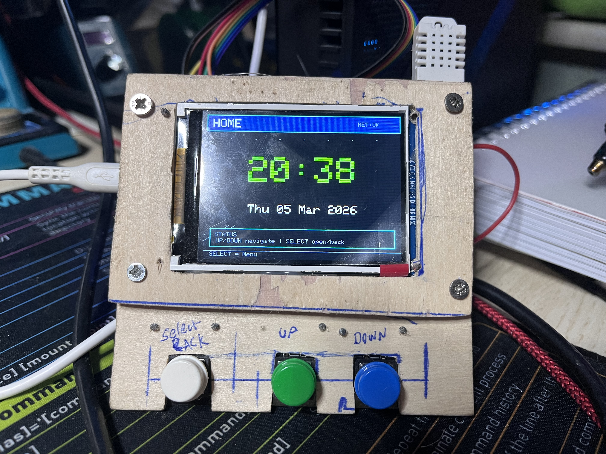
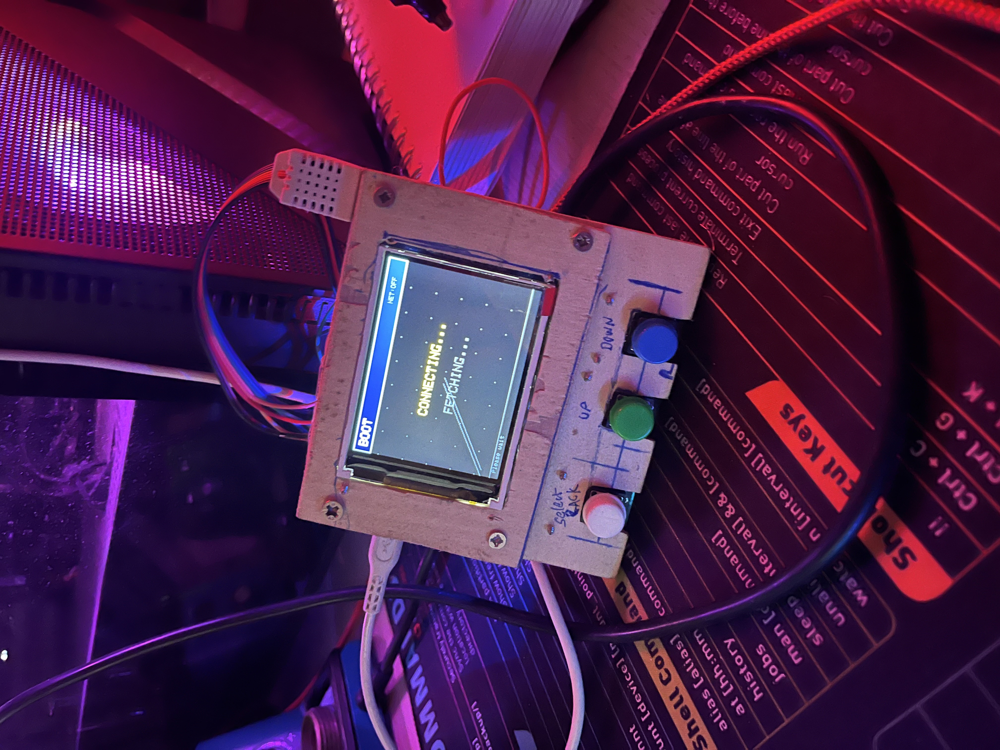
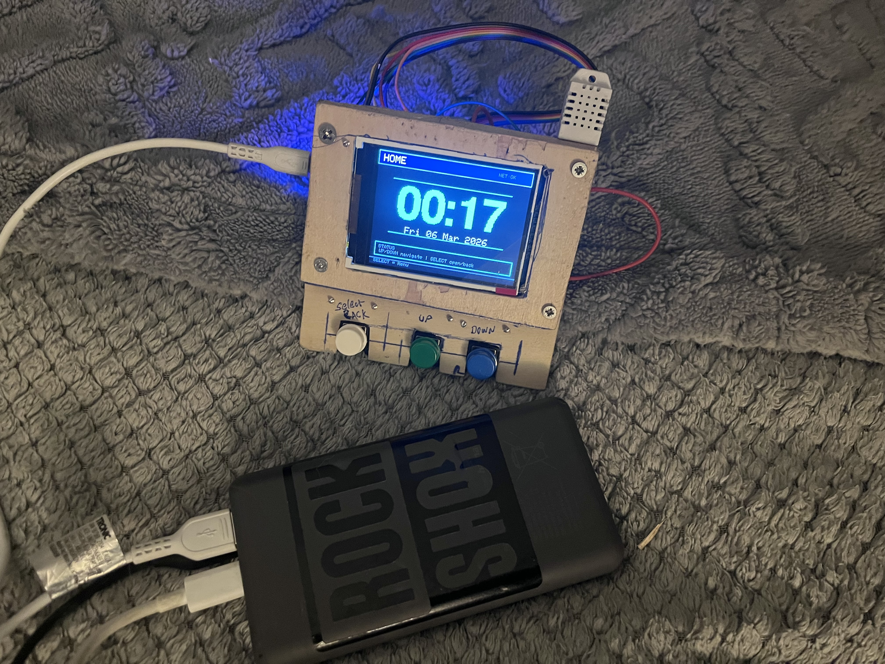

### Fase 2 New UI
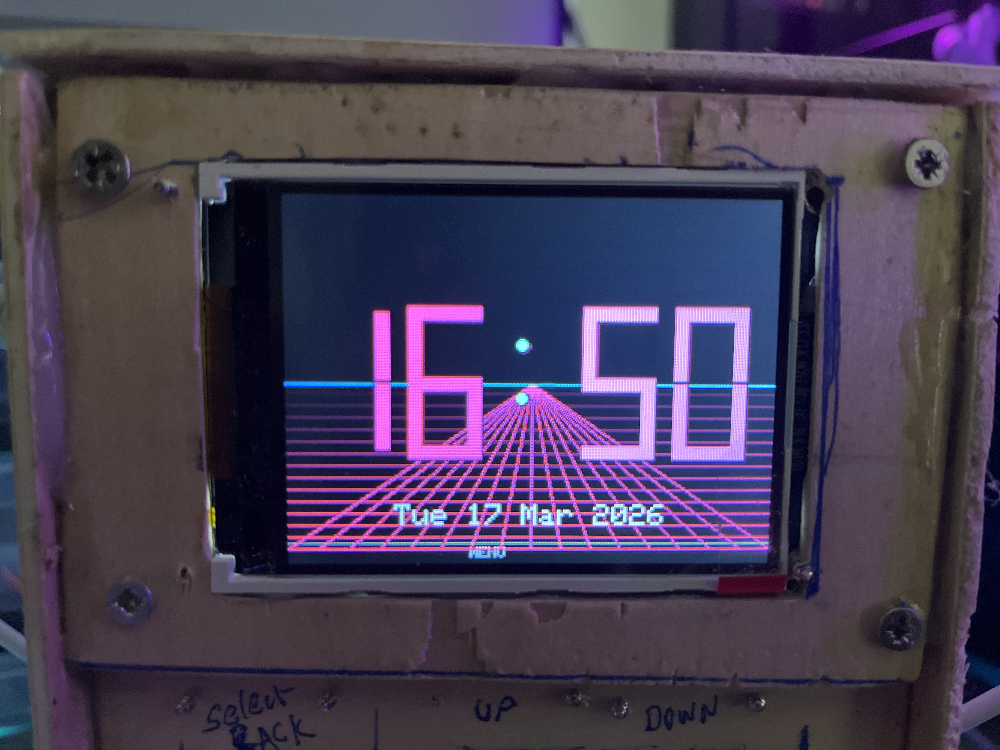
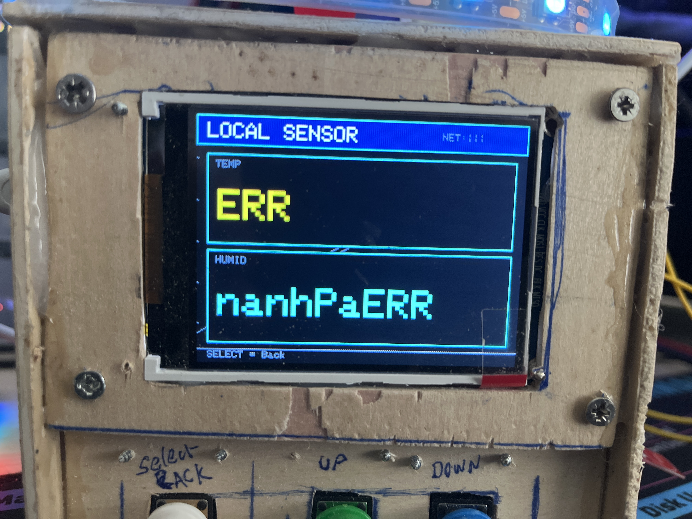

### Fase 3 Led Strip && Animations
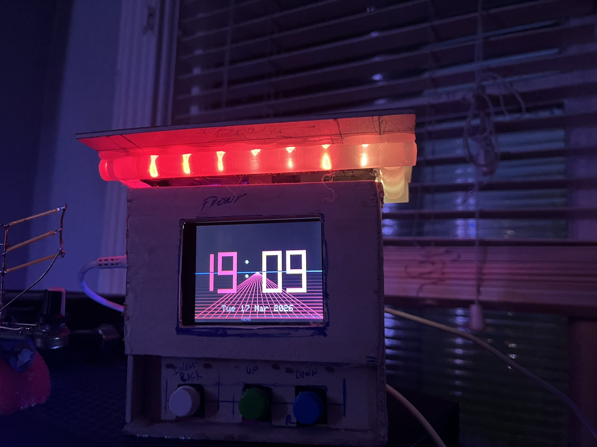

### Airport Weather Screen
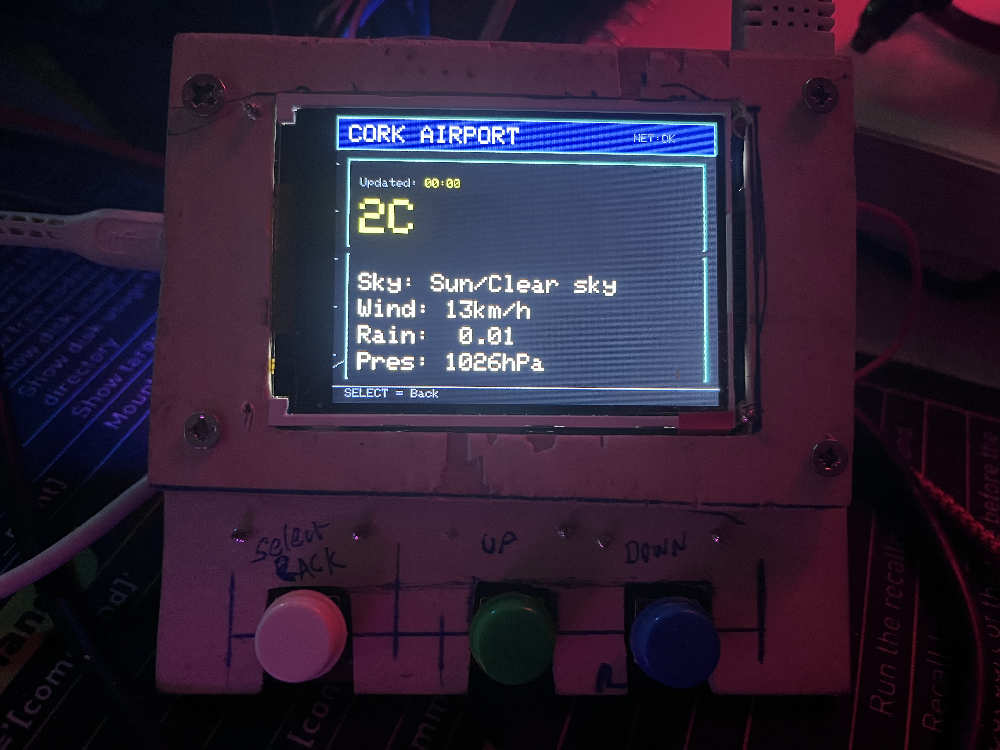

### BBC News Screen
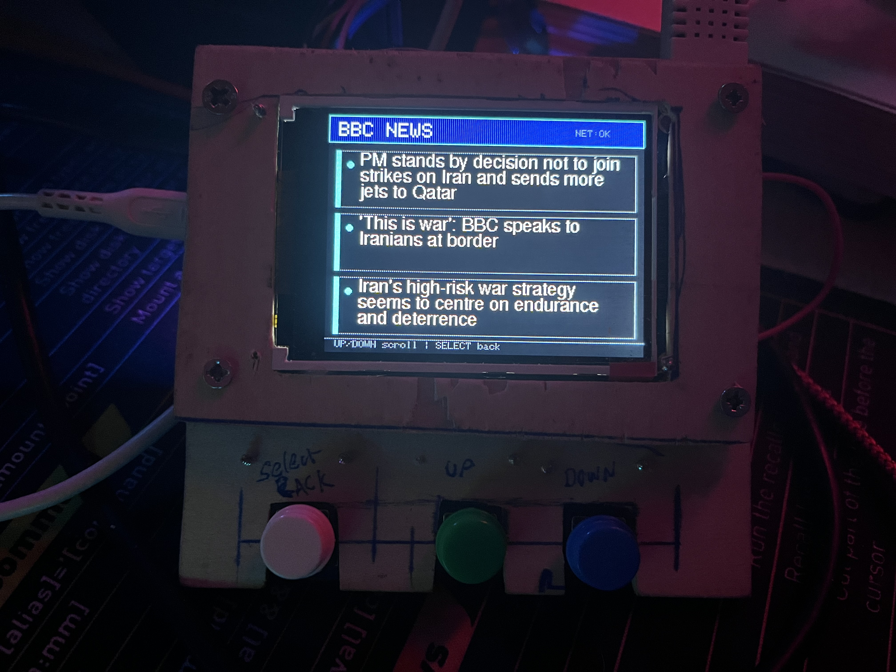

### RSS News Screen
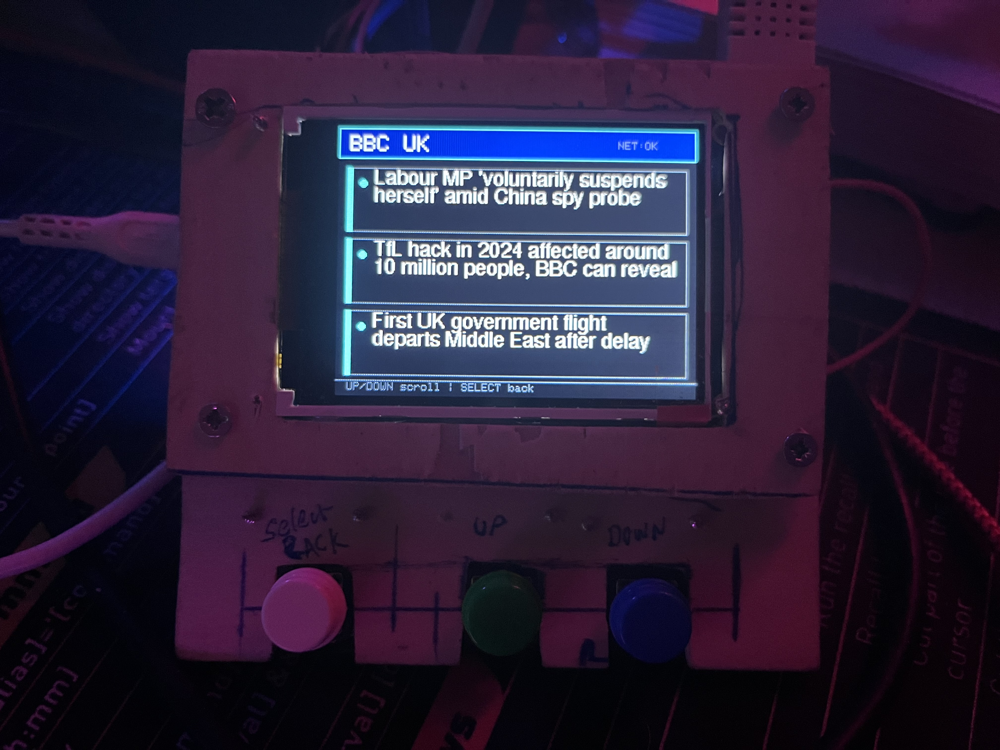
---

## How It Works

The ESP32 connects to WiFi and retrieves:

• Current time from NTP servers  
• RSS feeds from online news sources  

It also reads environmental data from the DHT22 sensor.

All information is displayed on the TFT screen through a menu-driven interface.

---

## Software

Developed using:

- Arduino IDE
- C++
- ESP32 WiFi libraries
- HTTPClient
- Adafruit ILI9341 TFT library
- BME280 sensor library
- Led WS2812

---

## Author

**Killo0077**

Software Development Student  
Embedded Systems & IoT Enthusiast
